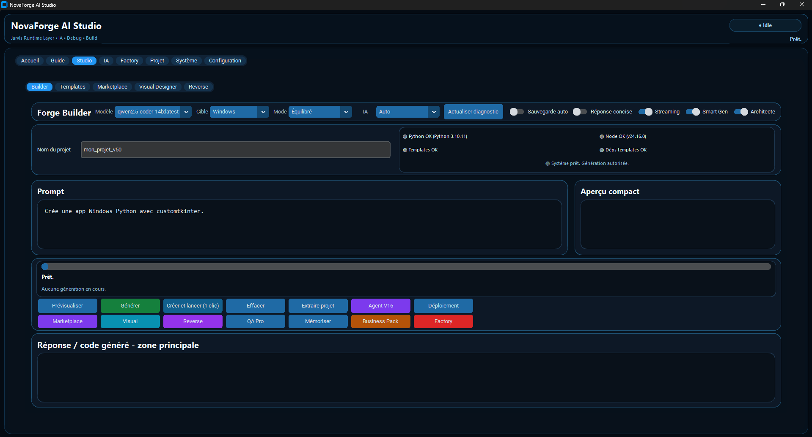
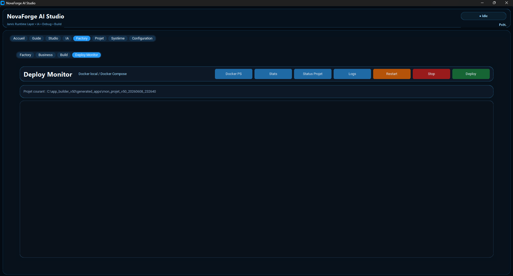
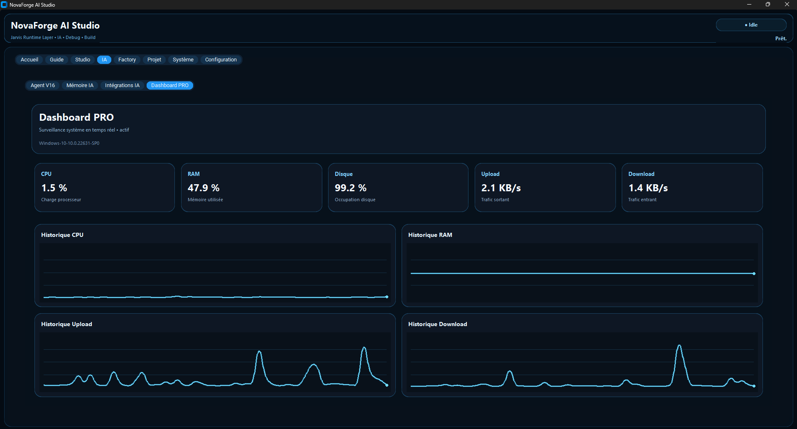
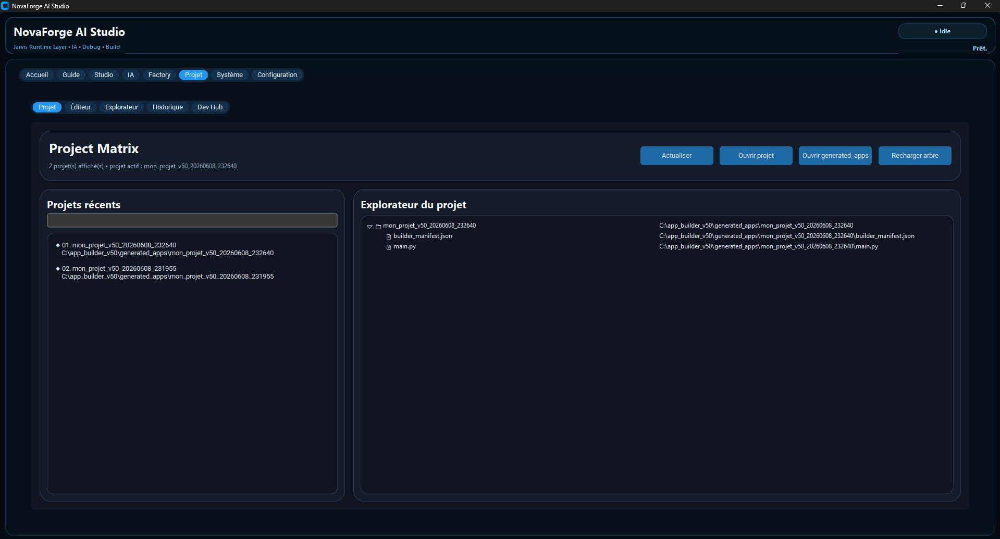
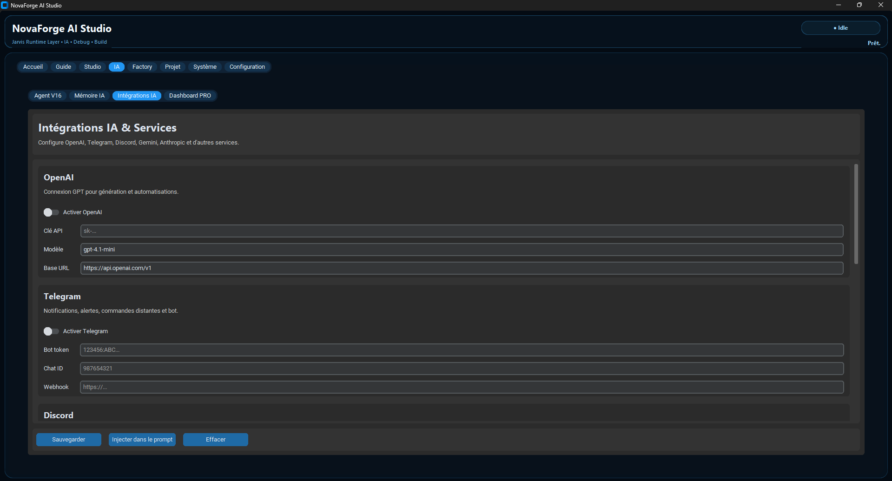
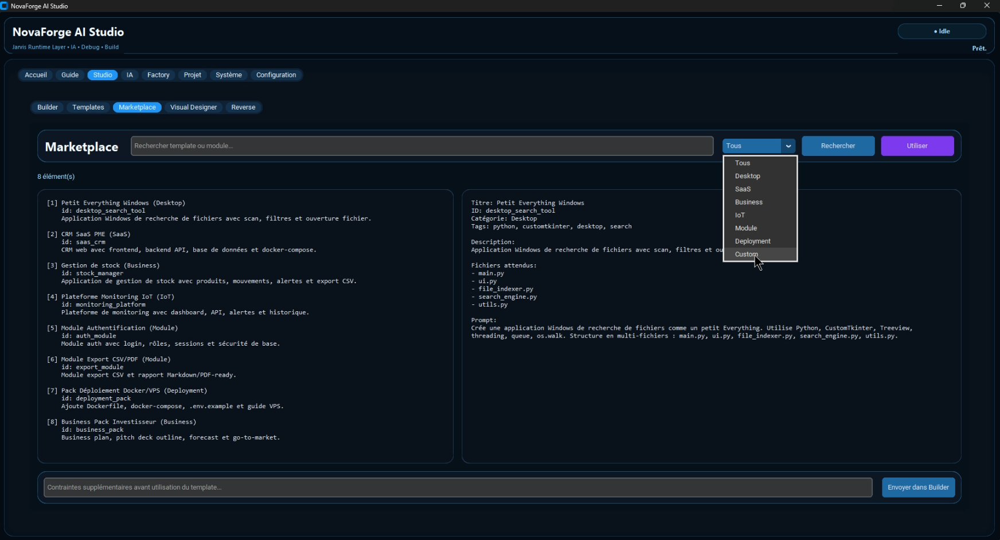

# 🚀 NovaForge

## AI-Powered Application Creation Platform

## Screenshots

### AI Project Builder

### Deploy Monitor

### Monitoring Dashboard

### Project Matrix

### AI Integrations

### Marketplace

NovaForge is an AI-driven software creation platform designed to help entrepreneurs, startups, SMEs and developers transform ideas into production-ready applications faster than traditional development methods.

Our vision is to democratize software creation by combining artificial intelligence, automation and modern cloud technologies into a single integrated environment.

---

## Mission

Building software remains expensive, complex and time-consuming.

NovaForge aims to reduce these barriers by automating the entire application lifecycle:

* Requirements analysis
* Application generation
* User interface creation
* API and database generation
* Docker environment creation
* Deployment automation
* Monitoring and maintenance

By reducing technical complexity, NovaForge enables innovators to focus on ideas and business value rather than infrastructure and development challenges.

---

## Screenshots

### AI Project Builder

Generate complete applications from natural language descriptions.

### Deploy Monitor

Monitor deployments, services, containers and application health.

### Monitoring Dashboard

Track system performance, resources and project metrics.

### Project Workspace

Manage projects, files, code and application assets from a unified interface.

---

## Key Features

* AI-powered project generation
* Visual application builder
* Multi-agent AI architecture
* Automated Docker deployment
* Linux, VPS and NAS deployment
* API integration
* Monitoring and maintenance tools
* Project management workspace
* Extensible plugin ecosystem
* Developer productivity tools

---

## Current Development Stage

NovaForge is currently at MVP stage and under active development.

Implemented modules:

* AI Project Builder
* Project Management
* Monitoring Dashboard
* API Integration
* Deployment Tools
* Deploy Monitor
* Developer Workspace
* Licensing System

Additional AI agents and advanced automation capabilities are currently being developed.

---

## MVP Status

NovaForge MVP is already functional and includes:

* Project generation
* AI-assisted workflows
* Monitoring tools
* Deployment automation
* Developer workspace modules
* API integrations
* System monitoring capabilities

The platform is continuously evolving through iterative development and user feedback.

---

## Market Opportunity

The rapid adoption of artificial intelligence is transforming software development worldwide.

NovaForge targets:

* Entrepreneurs
* Startups
* SMEs
* Freelancers
* Software agencies
* Educational institutions

through a scalable SaaS business model.

As demand for AI-assisted software creation continues to grow, NovaForge aims to position itself as a complete software lifecycle platform rather than a simple code generation tool.

---

## Competitive Advantage

Unlike many AI development tools focused solely on code generation, NovaForge aims to cover the entire software lifecycle:

* Idea to application generation
* Architecture design
* Code generation
* Deployment automation
* Monitoring and maintenance
* Infrastructure management

This integrated approach reduces complexity and accelerates software delivery.

---

## Roadmap

### 2026

* MVP stabilization
* Deploy Monitor enhancements
* Advanced AI project generation
* Multi-provider AI support
* User experience improvements

### 2027

* AI Agents ecosystem
* Marketplace for plugins and templates
* Team collaboration features
* Cloud deployment automation

### 2028

* Enterprise Edition
* Advanced multi-agent orchestration
* International expansion
* Industry-specific solutions

---

## Vision 2030

NovaForge aims to become a complete AI-powered software creation ecosystem covering the entire application lifecycle from idea to production deployment.

The long-term objective is to build a European technology platform capable of accelerating digital innovation for businesses of all sizes.

By combining artificial intelligence, automation and cloud technologies, NovaForge seeks to make software creation faster, more accessible and more affordable worldwide.

---

## Technology Stack

NovaForge leverages modern technologies including:

* Artificial Intelligence
* Python
* Docker
* Cloud Infrastructure
* API Integrations
* Linux-based Deployment Systems
* Monitoring and Automation Tools

---

## Founder

Mohamed Wirdane

Founder & Product Architect of NovaForge

Building the future of AI-powered software creation.
